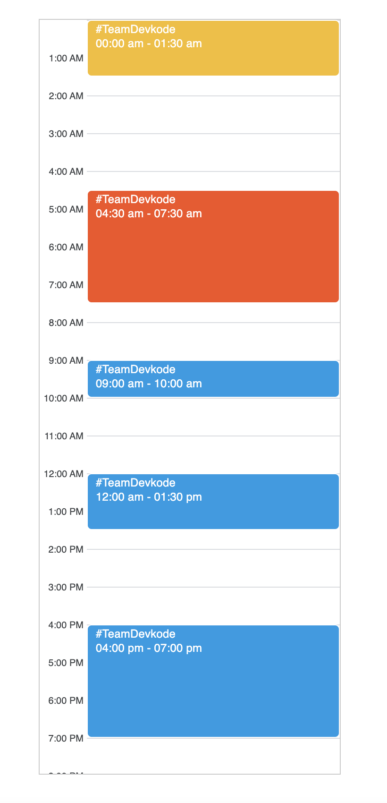
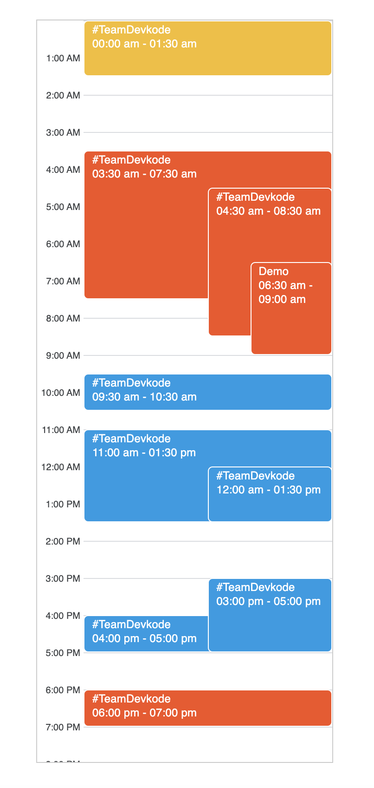

### Challenge 6: Day Calendar

Implement Day Calendar using HTML, CSS and Vanilla Javascript.

- Implement a Calendar, that shows the events for a single day.
- The events list is provided as an array of objects where each object has a title, start time, end time, and color code.
- The calendar should have 12 hours display. (AM - PM format)
- Handle the events clashes gracefully to display all the conflicting events.
- Display the Title and Timings on the event block
- As the challenge is UI-centric, prioritize the display of events and clash management.

#### Assumptions:

- The events in the array can be in any random order.
- Event's end time will always be higher than the start time with a non zero duration.

**Time Duration:** 120 minutes

#### Instructions:

- No need to focus on responsiveness.
- No use of any library or framework.
- Code should be well structured with optimised solution.
- Code should easily accomodate new requirements and minimal changes.

### Demo

> Non-conflicting meetings



> Conflicting Meeting



> Demo


<br />

> Sample Data: (Non-conflicting data)

```
[
    {
      startTime: "00:00",
      endTime: "01:30",
      color: "#f6be23",
      title: "#TeamDevkode",
    },
    {
      startTime: "4:30",
      endTime: "7:30",
      color: "#f6501e",
      title: "#TeamDevkode",
    },
    {
      startTime: "12:00",
      endTime: "13:30",
      color: "#029be5",
      title: "#TeamDevkode",
    },
    {
      startTime: "9:00",
      endTime: "10:00",
      color: "#029be5",
      title: "#TeamDevkode",
    },
    {
      startTime: "16:00",
      endTime: "19:00",
      color: "#029be5",
      title: "#TeamDevkode",
    },
    {
      startTime: "20:30",
      endTime: "22:30",
      color: "#029be5",
      title: "#TeamDevkode",
    },
  ]
```

<br />

> Sample Data: (Conflicting data)

```
[
    {
      startTime: "00:00",
      endTime: "01:30",
      color: "#f6be23",
      title: "#TeamDevkode",
    },
    {
      startTime: "3:30",
      endTime: "7:30",
      color: "#f6501e",
      title: "#TeamDevkode",
    },
    {
      startTime: "4:30",
      endTime: "8:30",
      color: "#f6501e",
      title: "#TeamDevkode",
    },
    {
      startTime: "6:30",
      endTime: "9:00",
      color: "#f6501e",
      title: "Demo",
    },
    {
      startTime: "11:00",
      endTime: "13:30",
      color: "#029be5",
      title: "#TeamDevkode",
    },
    {
      startTime: "12:00",
      endTime: "13:30",
      color: "#029be5",
      title: "#TeamDevkode",
    },
    {
      startTime: "9:30",
      endTime: "10:30",
      color: "#029be5",
      title: "#TeamDevkode",
    },
    {
      startTime: "16:00",
      endTime: "17:00",
      color: "#029be5",
      title: "#TeamDevkode",
    },
    {
      startTime: "15:00",
      endTime: "17:00",
      color: "#029be5",
      title: "#TeamDevkode",
    },
    {
      startTime: "18:00",
      endTime: "19:00",
      color: "#f6501e",
      title: "#TeamDevkode",
    },
    {
      startTime: "20:30",
      endTime: "22:30",
      color: "#029be5",
      title: "#TeamDevkode",
    },
    {
      startTime: "20:30",
      endTime: "22:30",
      color: "#029be5",
      title: "#TeamDevkode",
    },
  ]

```

All the best :)

<br />

[Telegram](http://t.me/teamdevkode) | [Instagram](https://www.instagram.com/devkode.io/) | [Website](https://learn.devkode.io/)
