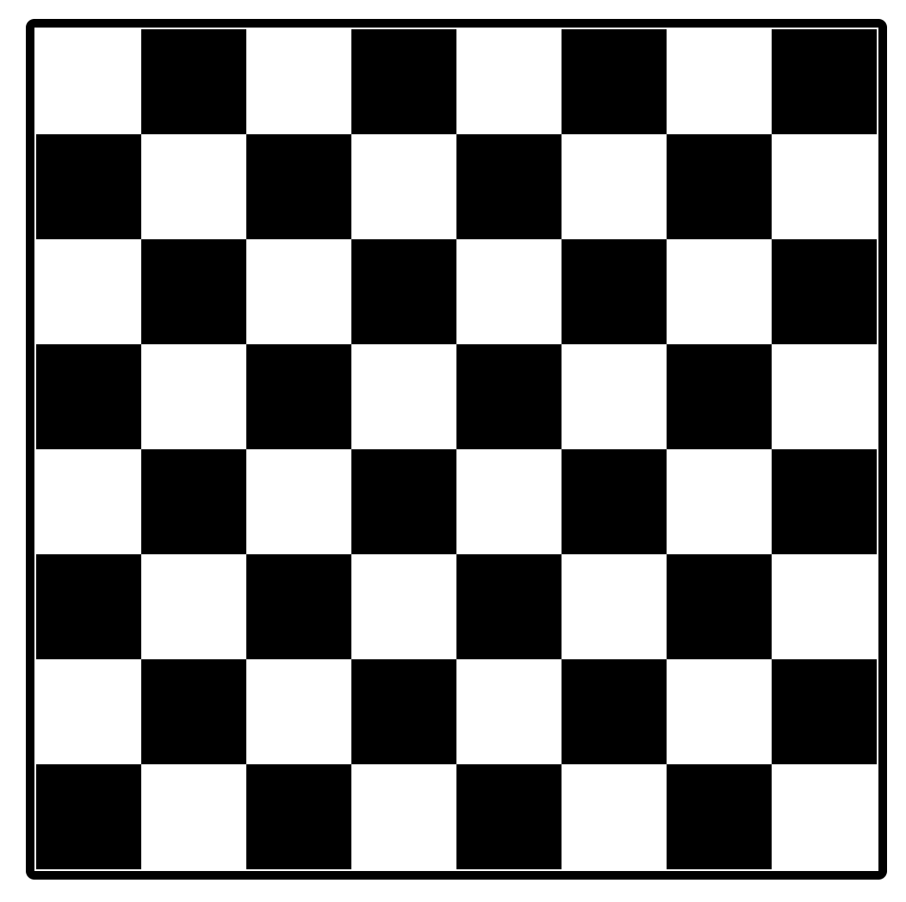
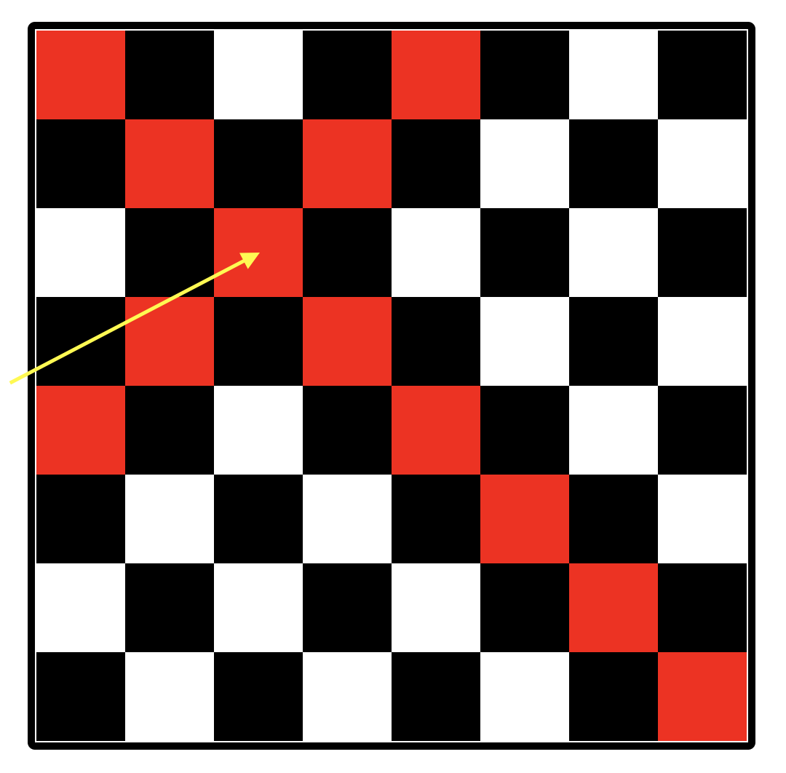

### Challenge 3: Chess Board

Create a chess board using HTML, CSS and Vanilla Javascript, where if you click on any of the block it should highlight its diagonals.

**Time Duration:** 90 minutes

#### Instructions:
- No need to focus on responsiveness.
- No use of any library or framework.
- Code should be well structured with optimised solution.

### Demo

> Default state

> On Click

**Chess Board:** It is a square form board in which there are equal rows and columns (8x8) with alternate intersections marked as black background.

All the best :) 

 

[Telegram](http://t.me/teamdevkode) | [Instagram](https://www.instagram.com/devkode.io/) | [Website](https://learn.devkode.io/)
