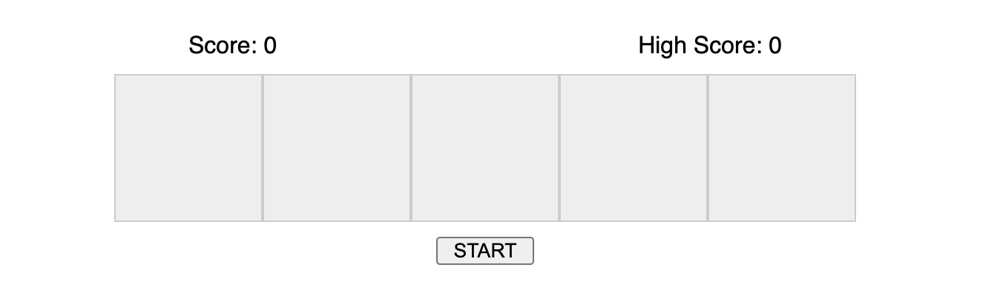
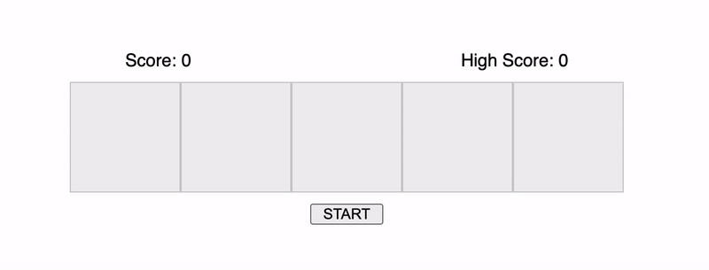
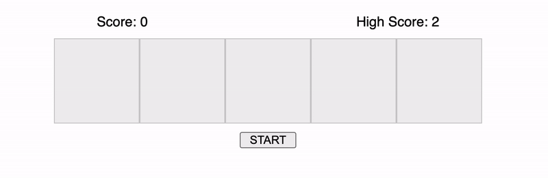

### Challenge 6: Memory Game

Implement Memory Game using HTML, CSS and Vanilla Javascript.

- Implement a memory game, that has a fixed number of blocks. Ex: 5 (programmatically configurable)
- Start the game on click of START button.
- Start blinking the blocks one after the other, starting from the count of 1. (single blink)
- The blinking of blocks must be completely random and the same block may blink twice in sequence.
- Let the user click the blocks in the same order of appearance.
- If user clicks are accurate, continue to the next level with the increased count.
- Else shake the container to indicate the wrong click and start over.
- Maintain the current score of the game.

**Time Duration:** 90 minutes

#### Bonus:

- Record and maintain the High Score.
- Store the High Score in Local Storage to persist over refresh.

#### Instructions:

- No need to focus on responsiveness.
- No use of any library or framework.
- Code should be well structured with optimised solution.
- Code should easily accomodate new requirements and minimal changes.

### Demo

> Default state



> Memory game demo



> In case of wrong attempt



<br />

> Reference: CSS

```
.shake {
    animation: shake 0.8s infinite;
    transform: translate3d(0, 0, 0);
}

@keyframes shake {
    0% {transform: translateX(0);}
    10%, 30%, 50%, 70%, 90% {transform: translateX(-8px);}
    20%, 40%, 60%, 80%,100% {transform: translateX(8px);}
 }
```

All the best :)

<br />

[Telegram](http://t.me/teamdevkode) | [Instagram](https://www.instagram.com/devkode.io/) | [Website](https://learn.devkode.io/)
