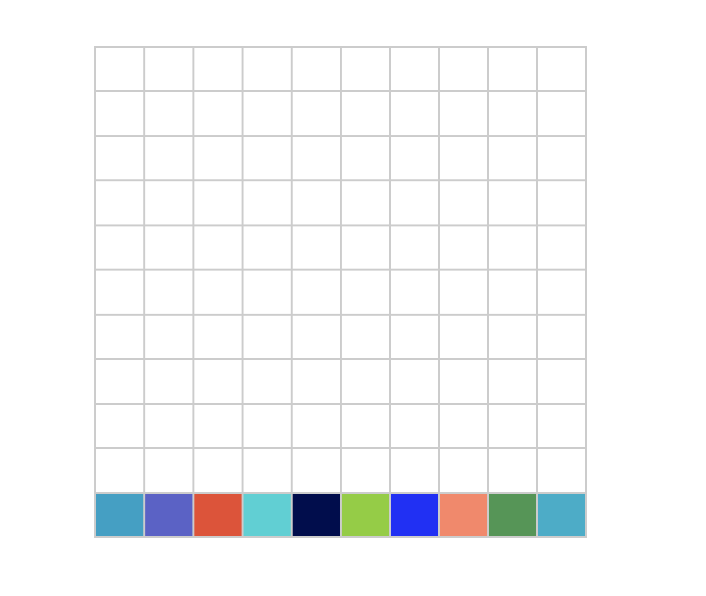
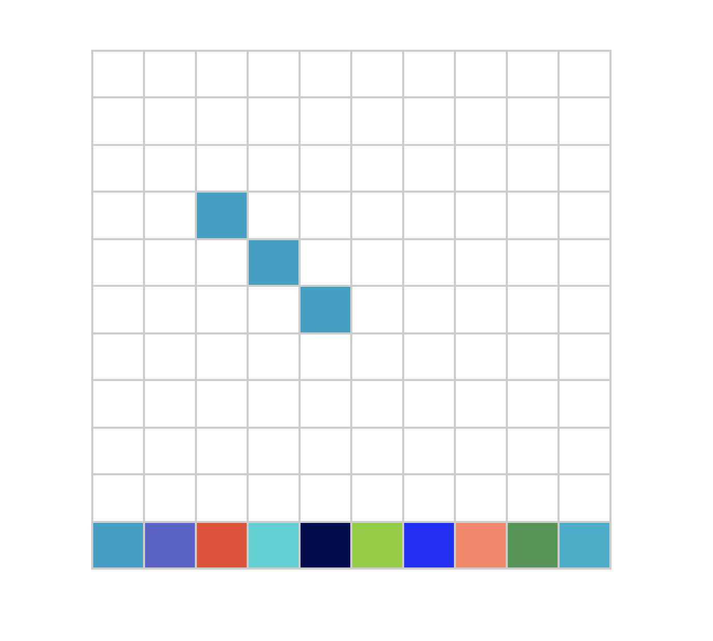
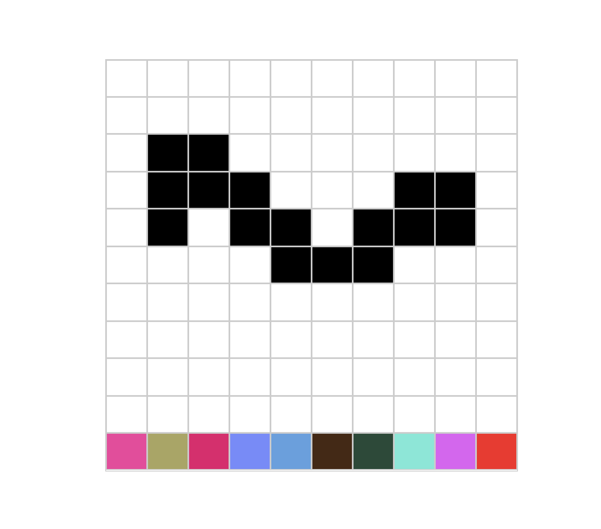

### Challenge 2: Pixel Art

Create Pixel Art grid using HTML, CSS and JavaScript

## Template

> HTML
```
<body>
    <div id="grid"></div>


    <script src="script.js"></script>
    <script>
        new PixelArt("#grid", 10, 10);
    </script>
</body>
```


> JS

```
/*
 * Creates pixel art grid
 * @param el DOM Element
 * @param rows Number of rows
 * @param rows Number of cols
 */
function PixelArt(el, rows, cols) {
    // write logic to create pixel art grid.
}

```

### Demo

> Default state



> On Click



> On Drag



<br />

[Telegram](http://t.me/teamdevkode) | [Instagram](https://www.instagram.com/devkode.io/) | [Website](https://learn.devkode.io/)
